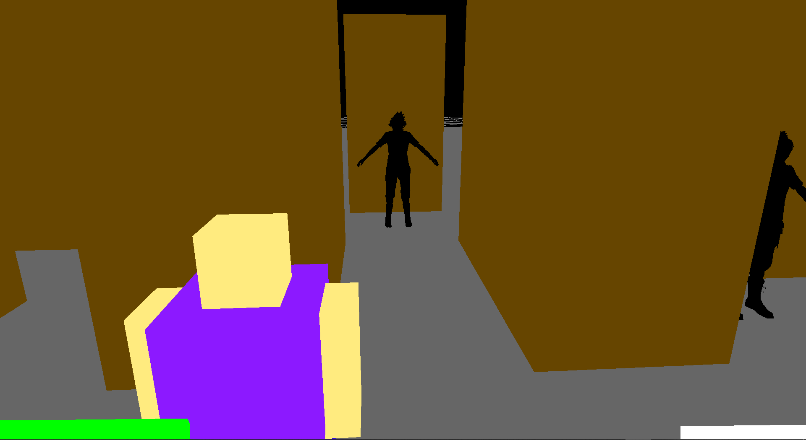
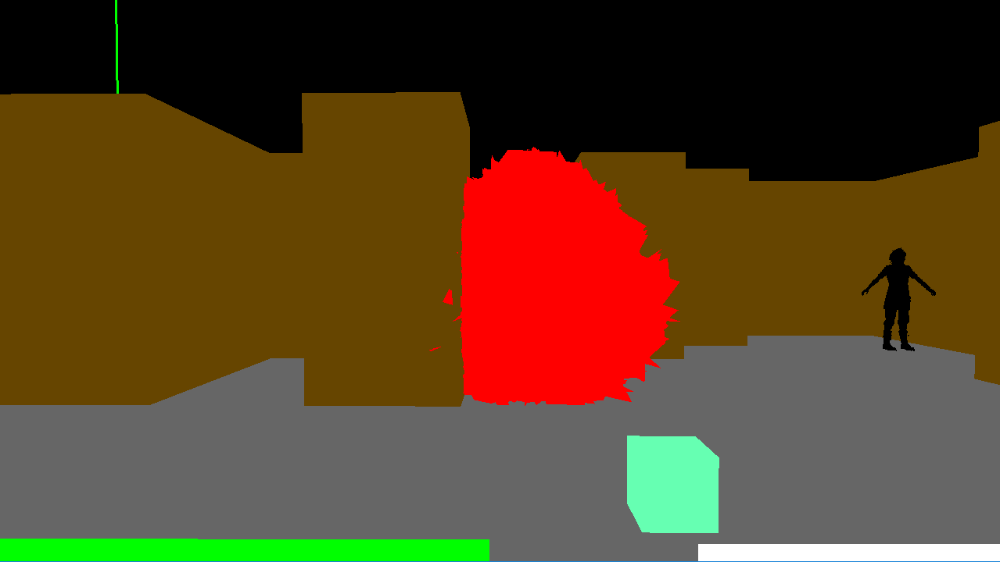
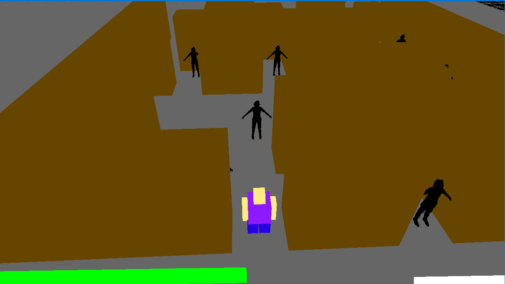

# Maze Escape 3D game in OpenGL and C++

## About

https://ocw.cs.pub.ro/courses/egc/teme/2021/02

Design a survival 3D game involving a maze escape using shape manipulations, game physics and algorithms in 3D

## Structure

### For creating the game I used the following files:

- tema2.cpp 

The whole computation part is done in this file with the using of the framework from the EGC team alongside the OpenGL libraries

- tema2.h & tema2_lab_camera.h & shaders

Adapted few laboratories and added functions to generate the maze using Aldous-Broder algorithm and to test if player/enemy is alive, collisions, movements, firing bullets, creating new shapes etc.

## Description of flow

- Scene

The scene is generated using the Aldous-Broder algorithm and it is coloured using a custom shader. While playing, you can see at the left bottom a health bar and at the right bottom a time bar for finishing the maze in under 30 seconds. By pressing left CTRL the player goes in first person mode, and pressing CTRL again goes back to third person mode. Also, by pressing R the camera is reseted to match the middle of the screen. While in first person mode or attack mode, the player can press Left Click to shoot bullets and gain a higher score.

- Hero

The hero is constructed using 6 meshes, each mesh is translated as soon as keyboard buttons are pressed to show movement. Hero also has health that gets diminuated if an enemy touches him and also a score, shown in the console at every kill he makes. The hero can kill enemies by going into the
attack mode or the first person camera by pressing left CTRL where he can shoot bullets through a gun

Hero gets blocked by obstacles and if he collides with enemies, it gets a semnificant amount of health drain.

- Enemy

Enemy is constructed using 1 imported mesh. The enemy is placed randomly at a free position in the maze and proceeds to move along its cell. For this movement I chose a 'plus' grid of moving. If the enemy touches the hero, it gives a big amount of health drain, but also due to its movement the hero can try and go past him without killing him. When an enemy gets killed by a bullet or by the hero crashing into it, a death animation appears, sort of an explosion that it is generated using vertex displacement on the Deformed Shader.

- Obstacle

Obstacles are placed on map according to the maze generation. Hero can collide with obstacles and also bullets cannot go through them.

- Bullet

The bullet is fired using the left mouse click on attack mode, and follows the direction given by it at a certain distance. This means that after the bullet is shot, if it doesn't hit an obstacle, the map grid or an enemy it disappears.
Enemies hit by bullets die instantly, and obstacles hit by it absorb the bullet. The bullet movement is done by translating it in the direction of the forward vector of the camera, so it goes accurately where the player is looking.

- Others

  - check_obstacle_collision(): tests if the hero or the bullets touch an obstacle, if so then they are stopped - can't go over the obstacle so they
need to move in another direction.

  - check_dead(): check if enemies are dead from the bullets. If enemies are dead, the explosion is rendered.

  - setupHUD(): shows the health bar and time bar to screen, also them being updated as time passes and health gets decreased.

